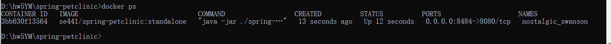
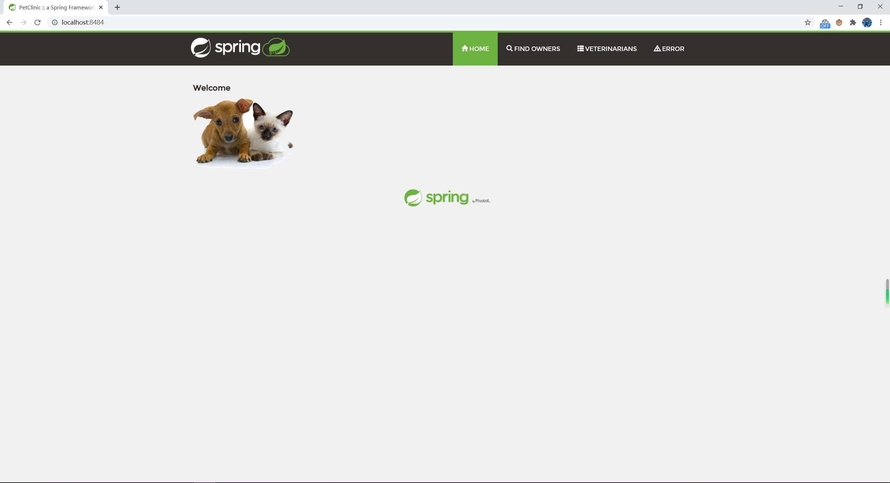
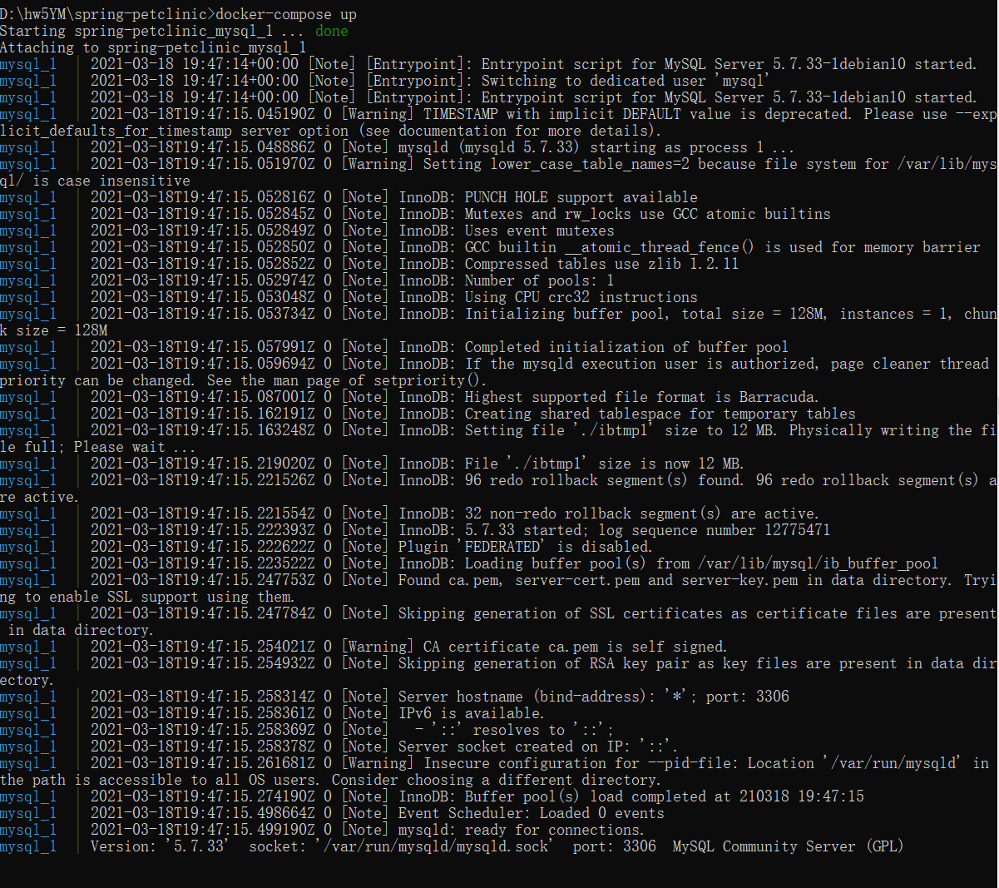
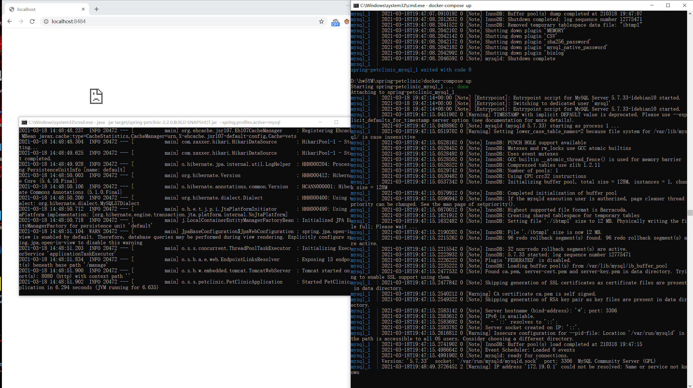
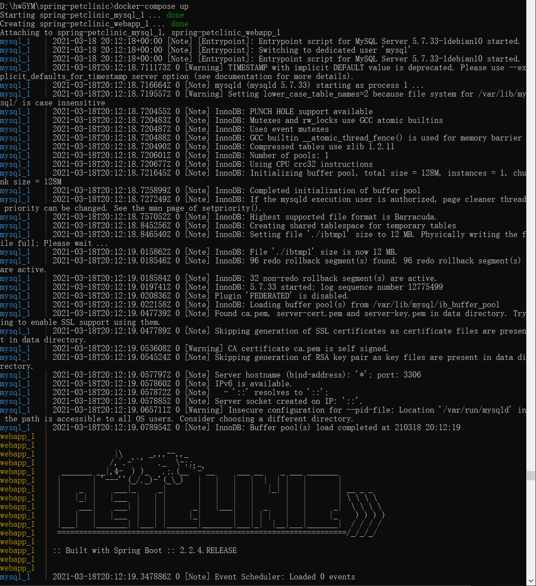
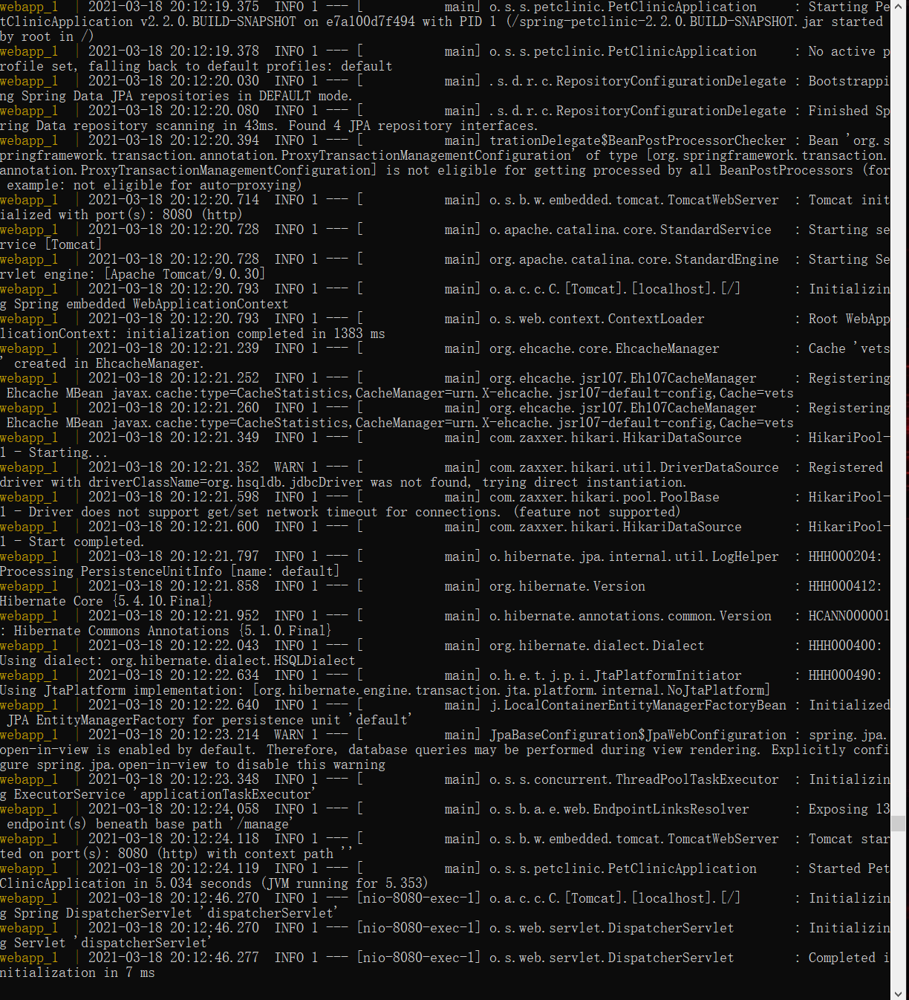
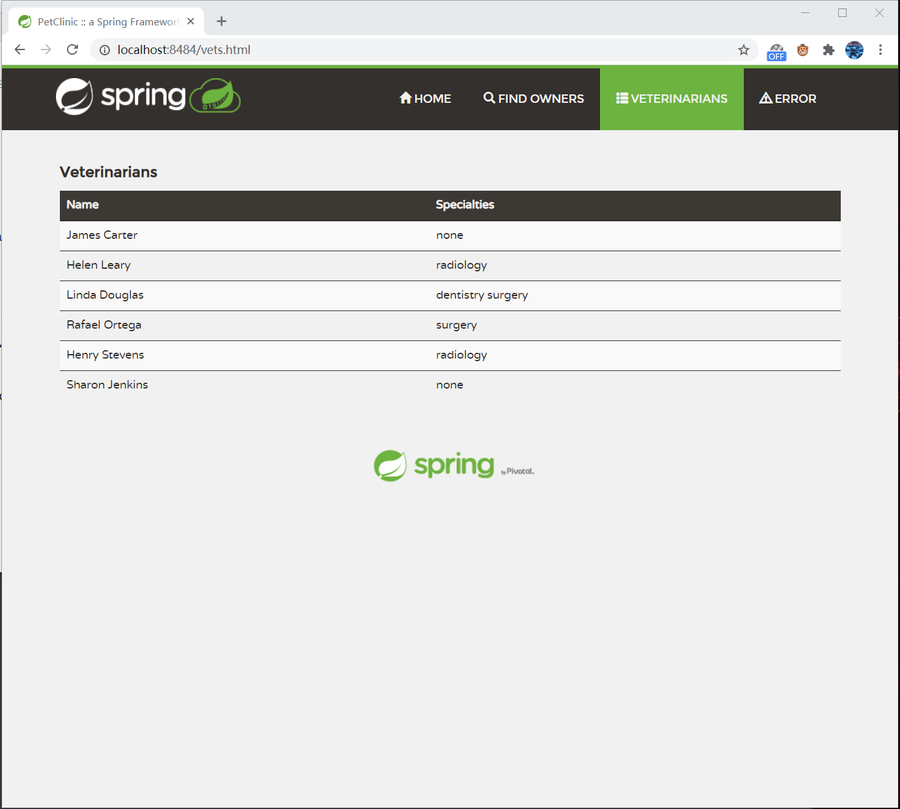

**Name: Yiji Man  Student ID: 1888972**

running docker instance as shown by a ps command.

browser accessing the main page of the website from your local container

output from the docker-compose up command.

browser accessing the \Veterinarians" page -- I could not access to the website while using mysql only. The container and the app are both running but still no access

A section of the stack trace generated

output from the docker-compose up command.

browser accessing the \Veterinarians" page

